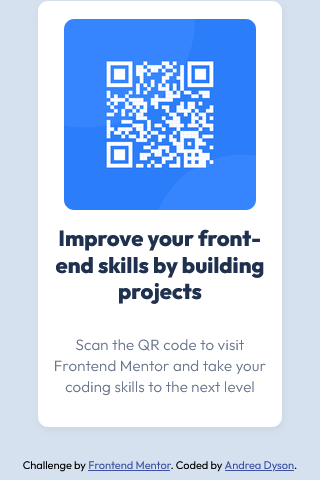
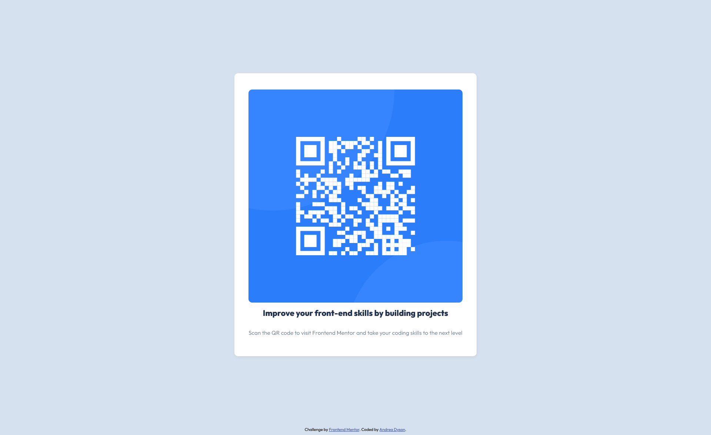

# Frontend Mentor - QR code component solution

This is a solution to the [QR code component challenge on Frontend Mentor](https://www.frontendmentor.io/challenges/qr-code-component-iux_sIO_H). Frontend Mentor challenges help you improve your coding skills by building realistic projects. 

## Table of contents

- [Overview](#overview)
  - [Screenshot](#screenshot)
  - [Links](#links)
- [My process](#my-process)
  - [Built with](#built-with)
  - [What I learned](#what-i-learned)
  - [Continued development](#continued-development)
  - [Useful resources](#useful-resources)
  - [AI Collaboration](#ai-collaboration)
- [Author](#author)
- [Acknowledgments](#acknowledgments)

**Note: Delete this note and update the table of contents based on what sections you keep.**

## Overview

### Screenshot

### Links

- Solution URL: [Add solution URL here](https://your-solution-url.com)
- Live Site URL: [Add live site URL here](https://your-live-site-url.com)

## My process

I started with the HTML and set up a the container for the main content, which included the qr code image and the heading and the paragraph. I also moved the CSS to an external stylesheet. From there I added comments to the bottom of my stylesheet to keep track of the colours and the fonts. Played around with some of the different ways to position content, and determined that it would be better to use flexbox. Added in the responsive web design.  

### Built with

- Semantic HTML5 markup
- CSS custom properties
- Flexbox

### What I learned

From this project, I learned it is best to keep it simple. I was not using flexbox to begin with and found it was overcomplicating sizing and responsive design aspects. After I implemented flex into the css, it really simplified the process and made for a smoother transition from desktop to mobile. 

As someone with around 2 and half years of education in web design and development, this was not that difficult of a challenge, but it did help me to recall important key elements to crafting a web page. I am quite eager to move on to the next challenges to reinforce the learning I've had already. 

### Continued development

I would like to become more experienced with flex box, as I am not quite an expert in using it. I do need more practice in responsive design too.

### Useful resources

- [W3 Schools CSS Flexbox](https://www.w3schools.com/css/css3_flexbox.asp) - This helped me understand how flex works in CSS. 

### AI Collaboration

I purposely did not use AI on this challenge because I wanted to make sure that I have a concrete understanding of the HTML and CSS I used to complete this project. 

## Author

- Website - [Andrea Dyson](https://itsocodedesign.ca/)
- Frontend Mentor - [@Momzilla007](https://github.com/Momzilla007)
- LinkedIn - [Andrea Dyson](https://www.linkedin.com/in/andrea-dyson-33994056/?skipRedirect=true)

